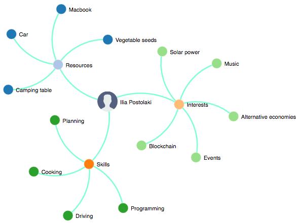

# Comeo!

Comeo is a crowdfunding platform featuring network of people, their resources, skills and interests.

  
###### Example of a Comeo user's public profile

## Current status
Basic users management and crowdfunding features are implemented at the moment.
###### Live beta: [http://lab.comeo.org.md](http://lab.comeo.org.md)
**Upcoming features:**  
- Matching of people which may be interested to work on common projects  
- Visual representation of a project with it's demanded resourses as a graph  
- Smart contracts for automatic value distribution between projects participants

## System Fact Sheet

**Back-end:**  
Python, Django, Nginx, Gunicorn, Docker, PostgreSQL, Neo4j,
Celery+RabbitMQ  
**Front-end:**  
HTML, CSS, jQuery, Bootstrap, D3.js  
**Tools:**  
Fabric, Livereload, Django Debug Toolbar, flake8

## Run the system
Makefiles and docker-compose are used to build and run system for different environments.  
`make run` in the project root will run containers for [dev environment](/Docker/dev).  
`cd ./docker/lab/ && make run` will run staging environment containers.

## Tests
`make test` will run unit tests in separate set of containers which will include ephemeral Neo4j database instance.

## Simulation
There is a [simulation module](/simulation) used to generate users and fill their personal graphs with fake data. It is used to implement and test new features.  
